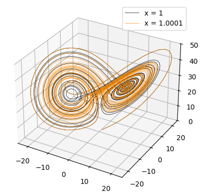
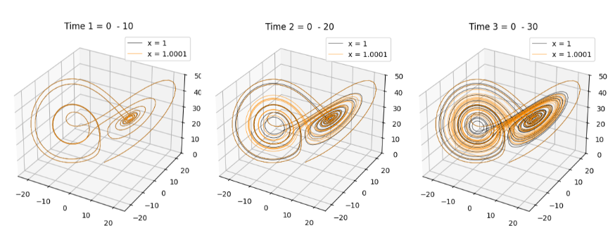
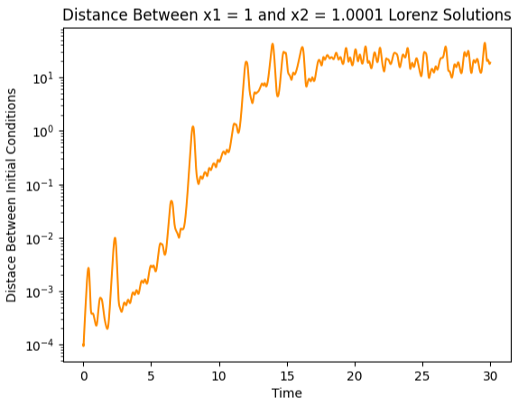

# Lorenz Model

## Overview

In 1963, Edward Lorenz, in his paper "Deterministic Nonperiodic Flow," explored the nonlinear impacts of the Saltzman equations, which are a set of three ordinary differential equations that model atmospheric convection:

$$
\frac{dx}{dt} = \sigma (y - x)
$$

$$
\frac{dy}{dt} = x(\rho - z) - y
$$

$$
\frac{dz}{dt} = xy - \beta z
$$

where x is the fluid flow rate (i.e., the convection rate), y is the temperature difference, z is the effect of the nonlinear vertical temperature profile, $\sigma$ is the Prandtl number (a diffusivity ratio), $\rho$ is the Rayleigh number (buoyancy), and $\beta$ refers to the system dimensions. This system was foundational to the development of chaos theory, or the idea that slight changes in initial conditions can cascade into large differences. The model output is known as a Lorenz Attractor and resembles that of a butterfly, which gives rise to the term "the butterfly effect".

## Numerical Methods

The model developed here runs on a forward Euler time-stepping scheme. Note that since this is a first-order method, the model can suffer from numerical drift given a large time step (dt) value.

## Running the Model

The model code is housed in the file "Lorenz_Model_CODE.py." All model parameters are detailed within that file and are given below as well. The output displays the classic Lorenz Attractor.

## Model Input

dt -> time step (DEFAULT: 0.01)

time -> the time range (DEFAULT: np.arange(0, 30, dt))

x -> convection rate (DEFAULT: 1)

y -> temperature difference (DEFAULT: 1)

z -> nonlinear vertical temperature profile (DEFAULT: 1)

sigma -> diffusivity effect (DEFAULT: 10)

rho -> buoyancy effects (DEFAULT: 28)

beta -> system dimensions (DEFAULT: 8/3)

## Output Example

The example output below shows the extreme sensitivity to the chosen initial conditions. The plot below contains a black line and an orange line (done using the code found in "Lorenz_Model_CODE.py" using multiple runs and saving each). The parameters for each line are shown below:

### Black Line

dt = 0.01

time = np.arange(0, 30, dt)

x = 1

y = 1

z = 1

sigma = 10

rho = 28

beta = 8/3

### Orange Line

dt = 0.01

time = np.arange(0, 30, dt)

x = 1.0001

y = 1

z = 1

sigma = 10

rho = 28

beta = 8/3

The only difference between the two model runs is that the black line uses x = 1 (i.e., convection rate), while the orange line uses x = 1.0001.

There is noticeable divergence between the two solutions presented in the figure above. The three-panel plot below offers further insight into the agreement between the two model solutions. From left to right, the figure shows the solutions from time 0-10, the solutions from time 0-20, and the solutions from time 0-30.

It is seen that at earlier timeframes, the two solutions are in good agreement with one another; however, as time progresses and we move further and further from the original time, the two solutions diverge from one another, as evidenced by the differing trajectories. This captures the inherent nature of nonlinearity and chaos theory by showing that a slight deviation as small as 1/1000 in the initial conditions leads to a cascading effect in terms of the final output solution. Taking it even one step further, it is possible to track the overall "distance" between the two solutions by simply adding the following line of code:

    distance = np.sqrt((x1_array - x2_array)**2 + (y1_array - y2_array)**2 + (z1_array - z2_array)**2)

where x1, y1, and z1 correspond to the solutions to the black line and x2, y2, and z2 correspond to the orange line. This line of code is commented out in the model code itself. The output from this code using the current model solutions gives:

It is seen that a difference of 1/1000 in the initial condition can lead to a cascading effect where the overall solution differs by almost $10^1$ by the final time frame.

## Future Ideas

1. Explore the impact that the Prandtl number has on the system.
2. Explore the effects of increasing (or decreasing) the time step (dt) and how this impacts the numerical stability of the system
3. Since the forward Euler time step is first order, it is subject to numerical drift. Implement a higher-order method, such as Runge-Kutta (fourth order -- RK4), and examine the numerical stability of the system.

## Packages

The packages needed to run this model are:
1. numpy
2. matplotlib
3. mplot3d from mpl_toolkits

## Use

The code here is free and available to download, use, and can be modified any way. I do ask for an appropriate acknowledgement should it be used in any kind of project, publication, teaching material, etc.

## Reference Links

https://doi.org/10.1175/1520-0469(1963)020<0130:DNF>2.0.CO;2 -> Lorenz 1963 paper

"Invisible in the Storm: The Role of Mathematics in Understanding Weather" by Ian Roulstone and John Norbury

